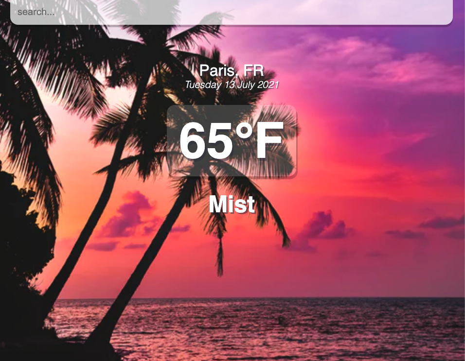
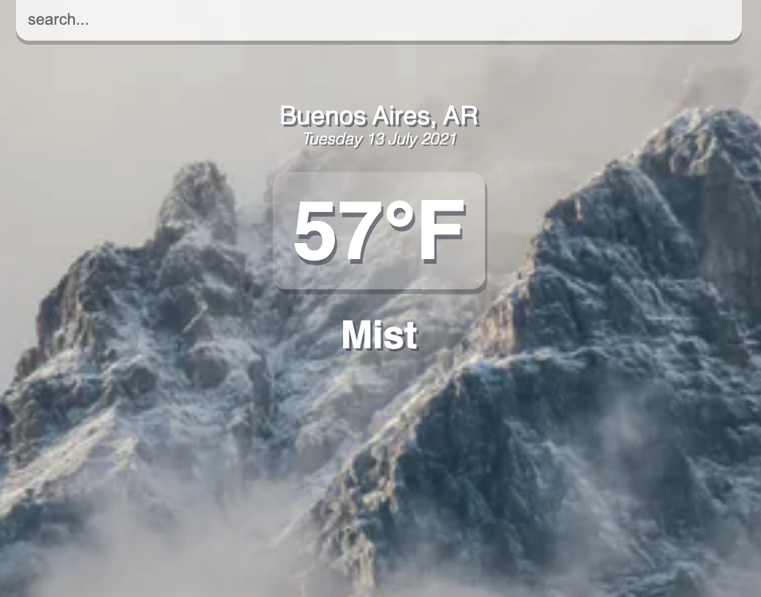

# React Weather app

A simple web app showing the weather

## technologies Used
- HTML5
- CSS3
- JS
- React
- Yarn
- Weather API(https://openweathermap.org/api)
- Netlify (for deployment)

## Screenshots

## Getting started
[click](https://react-wheather-app.netlify.app/) here to get started and see the app online! 

